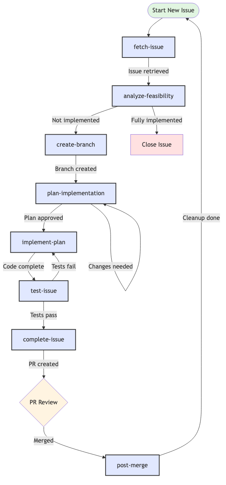
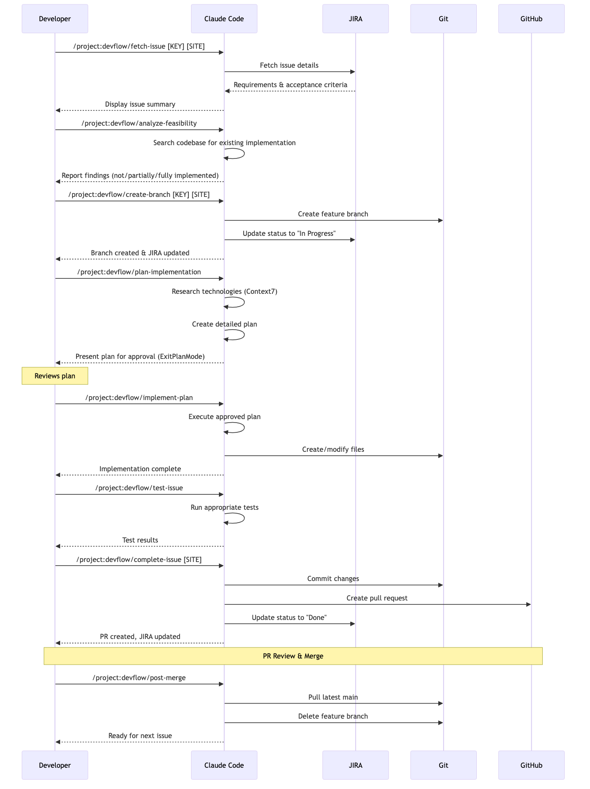
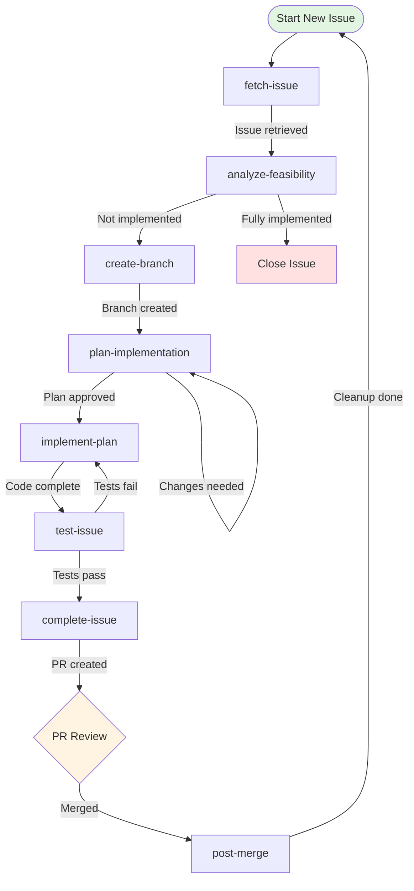
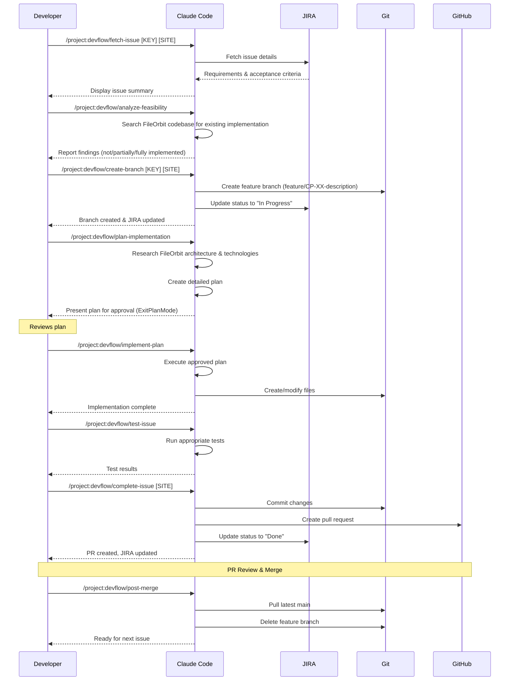

# DevFlow Workflow Guide

## Overview
This workflow breaks down JIRA issue implementation into focused, manageable phases. Each command has a single responsibility and guides you to the next step.

## Visual Workflow

### Simple Flow Diagram
This diagram shows the basic command flow and decision points:



### Detailed Sequence Diagram
This diagram shows all interactions between systems:



<details>
<summary>View/Edit Diagram Sources (Mermaid)</summary>

**Simple Flowchart:**


**Detailed Sequence:**


</details>

## Workflow Sequence

### 1. Fetch Issue → `/project:devflow/fetch-issue`
**Purpose**: Retrieve and understand the JIRA issue
**Input**: `[ISSUE-KEY] [SITE-ALIAS]`
**Output**: Issue summary with type, requirements, and acceptance criteria
**Next Step**: Analyze feasibility

### 2. Analyze Feasibility → `/project:devflow/analyze-feasibility`
**Purpose**: Check if requirements are already implemented
**Input**: None (uses context from fetch-issue)
**Output**: Assessment of existing implementations
**Next Step**: Create branch (if not fully implemented)

### 3. Create Branch → `/project:devflow/create-branch`
**Purpose**: Setup development branch and update JIRA status
**Input**: `[ISSUE-KEY] [SITE-ALIAS]`
**Output**: New branch created, JIRA updated to "In Progress"
**Next Step**: Plan implementation

### 4. Plan Implementation → `/project:devflow/plan-implementation`
**Purpose**: Research and create detailed implementation plan
**Input**: None (uses context from previous steps)
**Output**: Structured implementation plan ready for approval
**Next Step**: Review plan, then run implement-plan if approved

### 5. Implement Plan → `/project:devflow/implement-plan`
**Purpose**: Execute the approved plan - actual coding
**Input**: None (uses approved plan from previous step)
**Output**: Code implementation following the plan
**Next Step**: Test the implementation

### 6. Test Issue → `/project:devflow/test-issue`
**Purpose**: Test the implemented changes
**Input**: Optional test hints
**Output**: Test results and validation
**Next Step**: Complete issue if tests pass

### 7. Complete Issue → `/project:devflow/complete-issue`
**Purpose**: Create PR and update JIRA to Done
**Input**: `[SITE-ALIAS]`
**Output**: Pull request created, JIRA updated
**Next Step**: Wait for PR review and merge

### 8. Post Merge → `/project:devflow/post-merge`
**Purpose**: Sync with remote and clean up after merge
**Input**: None
**Output**: Local environment updated and cleaned
**Next Step**: Start next issue with fetch-issue

## Quick Start

```bash
# Start with fetching the issue
/project:devflow/fetch-issue CP-123 fileorbit

# The assistant will guide you through each subsequent step
```

## Decision Points

- **After Feasibility Analysis**: 
  - ✅ Not implemented → Continue to branch creation
  - 🔄 Partially implemented → Review what exists, then continue
  - ❌ Fully implemented → Stop and close issue
  - ⚠️ Conflicts found → Discuss with team before proceeding

- **After Planning**:
  - Review the plan carefully
  - If approved → Run `/project:devflow/implement-plan`
  - If changes needed → Request modifications
  - If rejected → Discuss alternative approach

- **After Implementation**:
  - Run `/project:devflow/test-issue` to validate
  - Fix any issues found during testing
  - Only proceed to complete-issue when tests pass

## Benefits of This Approach

1. **Reduced Cognitive Load**: Each command has one clear purpose
2. **Natural Flow**: Commands align with how LLMs process information
3. **Human Control**: You decide at each step whether to proceed
4. **Flexibility**: Can skip steps or restart at any phase
5. **Better Success Rate**: Smaller, focused prompts are more reliable

## Tips

- Save your SITE-ALIAS - you'll need it for fetch-issue and create-branch
- Each command preserves context for the next step
- You can always check status with `git status` between commands
- If something goes wrong, you can restart from any phase
- Branch naming follows FileOrbit convention: feature/CP-XX-description
- FileOrbit uses distributed architecture - consider orchestrator/agent impacts