# Voice Task Manager - System Architecture

## Overview

The Voice Task Manager is a Streamlit-based web application that enables intelligent task management through voice commands. The system combines speech recognition, natural language processing, and task management to provide a conversational interface for organizing and managing tasks.

## System Architecture

### High-Level Architecture

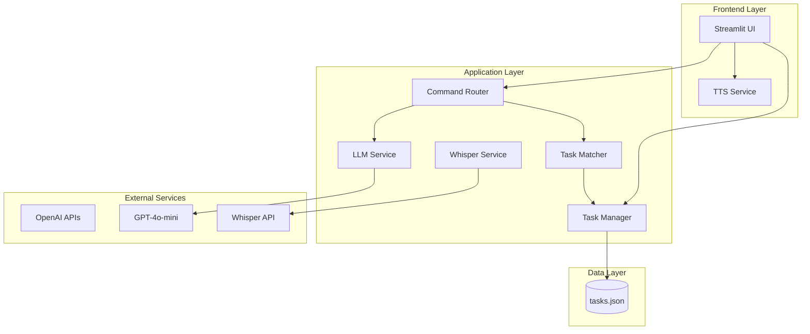

## Core Components

### 1. Frontend Layer

#### Streamlit UI (`app.py`)
- **Purpose**: Main user interface and application entry point
- **Responsibilities**:
  - Mode selection (Brain Dump vs Command)
  - Audio input capture
  - Task display and interaction
  - Session state management
  - Voice feedback integration

#### TTS Service (`services/tts_service.py`)
- **Purpose**: Provides voice feedback to users
- **Implementation**: Browser-native speech synthesis
- **Features**:
  - Action confirmations
  - Error messages
  - Status updates

### 2. Application Layer

#### Command Router (`services/command_router.py`)
- **Purpose**: Central orchestrator for processing voice commands
- **Responsibilities**:
  - Intent detection and classification
  - Task matching and identification
  - Action execution coordination
  - Response generation

#### LLM Service (`services/llm_service.py`)
- **Purpose**: Natural language processing and AI-powered task analysis
- **Capabilities**:
  - Intent detection from voice commands
  - Task extraction from brain dumps
  - Priority and category assignment
  - Task matching and identification
  - Task prioritization suggestions

#### Task Manager (`services/task_manager.py`)
- **Purpose**: Core task data management and persistence
- **Responsibilities**:
  - CRUD operations for tasks
  - Data validation and sanitization
  - Task statistics and analytics
  - File-based persistence (JSON)

#### Whisper Service (`services/whisper_service.py`)
- **Purpose**: Speech-to-text transcription
- **Implementation**: OpenAI Whisper API integration
- **Features**:
  - Real-time audio processing
  - High-accuracy transcription
  - Error handling and retry logic

#### Task Matcher (`services/task_matcher.py`)
- **Purpose**: Fuzzy matching for natural language task references
- **Algorithm**: SequenceMatcher-based similarity scoring
- **Features**:
  - Best match identification
  - Multiple match detection
  - Configurable similarity thresholds

#### Help Service (`services/help_service.py`)
- **Purpose**: AI-powered help system with dynamic assistance
- **Capabilities**:
  - Context-aware help responses
  - Voice and text question processing
  - Knowledge base integration
  - Task-aware suggestions
  - Quick reference generation
- **Features**:
  - Tutorial-style guidance
  - Command reference
  - Contextual tips based on current tasks
  - Voice input support for help questions

### 3. Data Layer

#### Task Storage (`tasks.json`)
- **Format**: JSON array of task objects
- **Schema**:
```json
{
  "id": "uuid",
  "text": "task description",
  "priority": "high|medium|low",
  "category": "client|business|personal|null",
  "completed": boolean,
  "created_at": "ISO timestamp",
  "modified_at": "ISO timestamp",
  "completed_at": "ISO timestamp|null"
}
```

#### Help Knowledge Base (`help_knowledge.md`)
- **Format**: Markdown documentation
- **Content**:
  - Tutorial information
  - Command reference
  - Usage tips and best practices
  - Troubleshooting guide
  - Feature explanations

## System Interactions

### 1. Brain Dump Mode Flow

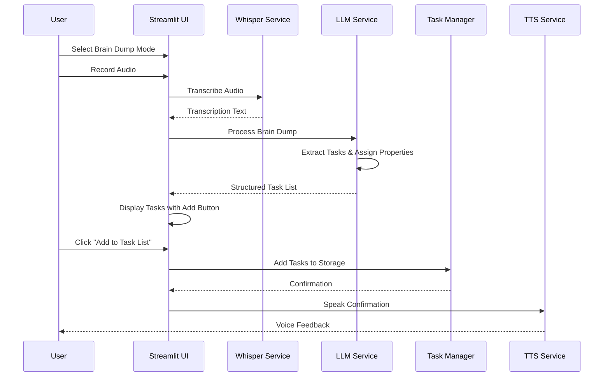

### 2. Command Mode Flow

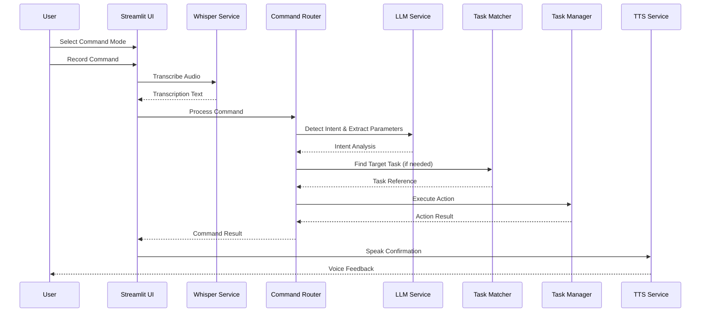

### 3. Task Modification Flow

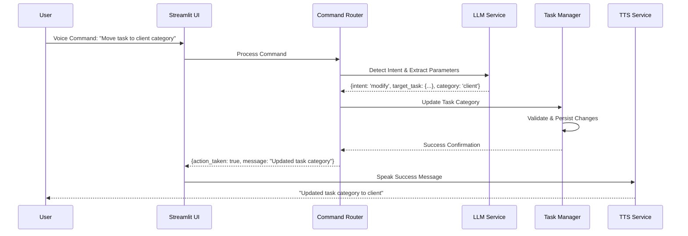

### 4. Help System Flow

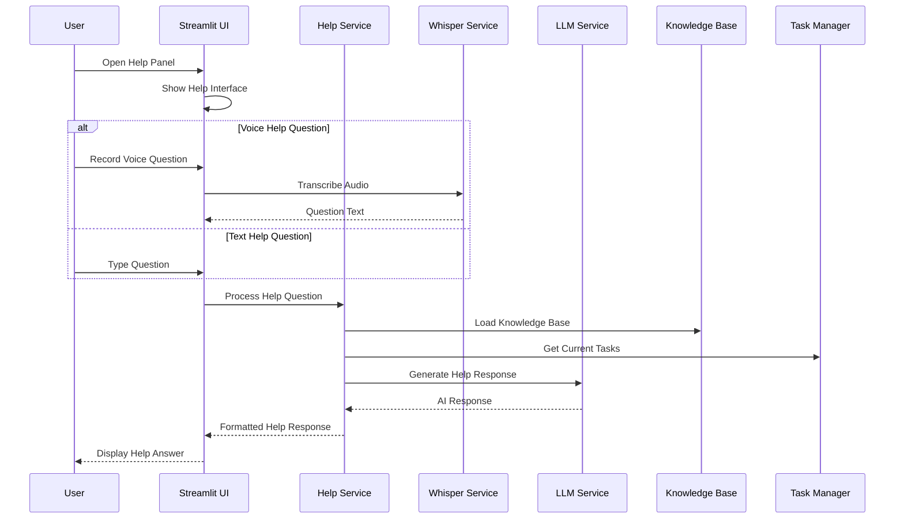

## Data Flow Architecture

### Session State Management

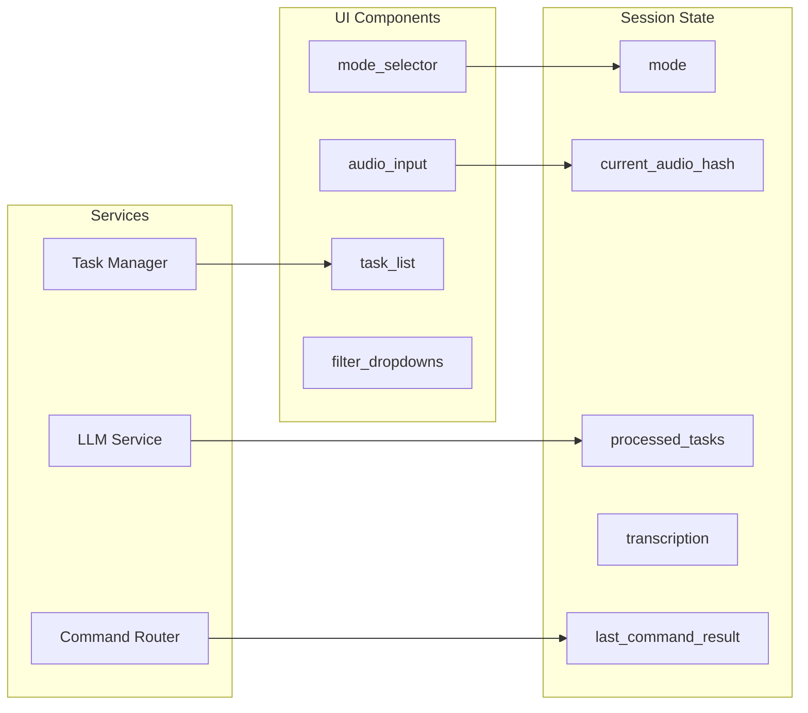

## Error Handling Architecture

### Error Flow

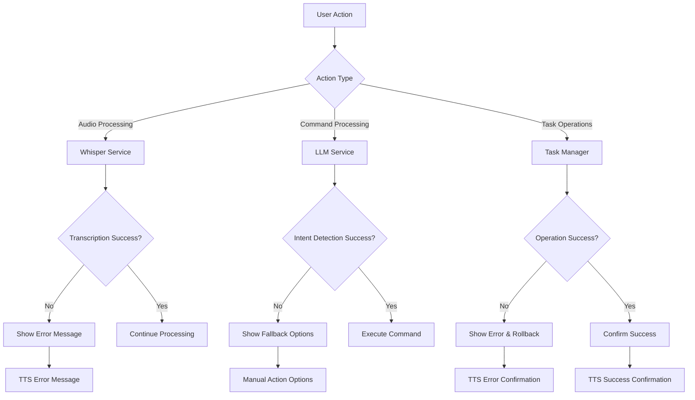

## Performance Considerations

### API Cost Optimization

```mermaid
graph LR
    subgraph "Cost Optimization"
        A[Audio Hash Caching]
        B[Session State Management]
        C[Intent Confidence Thresholds]
        D[Batch Operations]
    end
    
    subgraph "API Usage"
        E[Whisper API: $0.006/min]
        F[GPT-4o-mini: $0.00015/1M tokens]
        G[TTS: Browser-native (free)]
    end
    
    A --> H[Prevent Re-processing]
    B --> I[Minimize API Calls]
    C --> J[Reduce Ambiguous Commands]
    D --> K[Efficient Task Operations]
```

## Security Architecture

### Data Protection

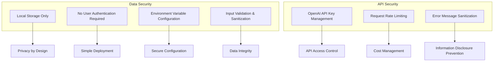

## Deployment Architecture

### Local Development Setup

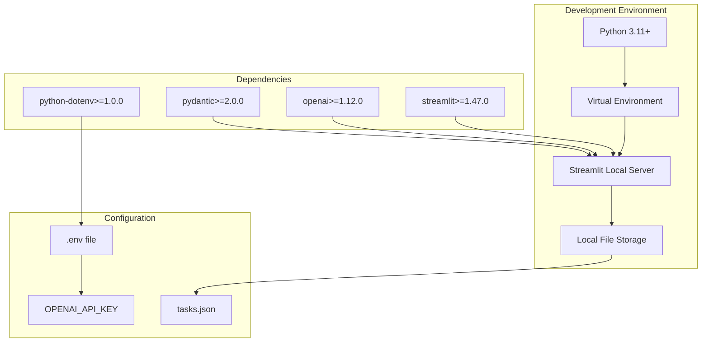

## Testing Architecture

### Test Coverage

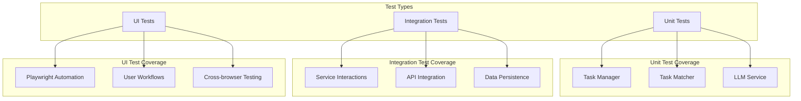

## Future Architecture Considerations

### Scalability Options

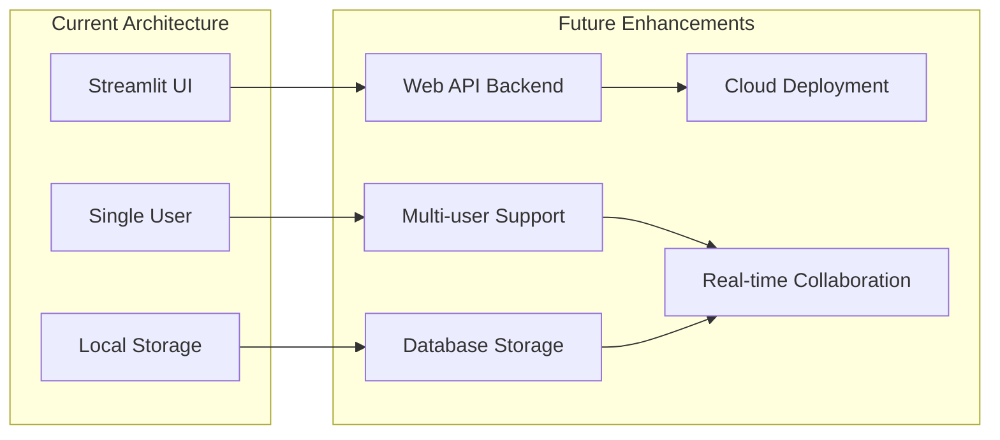

## Conclusion

The Voice Task Manager architecture is designed for simplicity, reliability, and extensibility. The modular service-oriented design allows for easy testing, maintenance, and future enhancements. The system successfully combines modern AI capabilities with intuitive user interaction patterns to create a powerful yet accessible task management solution.

### Key Architectural Principles

1. **Separation of Concerns**: Each service has a single, well-defined responsibility
2. **Loose Coupling**: Services communicate through well-defined interfaces
3. **Error Resilience**: Comprehensive error handling at each layer
4. **Cost Efficiency**: Optimized API usage and caching strategies
5. **User Experience**: Voice feedback and intuitive interaction patterns
6. **Maintainability**: Clean code structure and comprehensive testing
7. **Extensibility**: Modular design supports future enhancements 